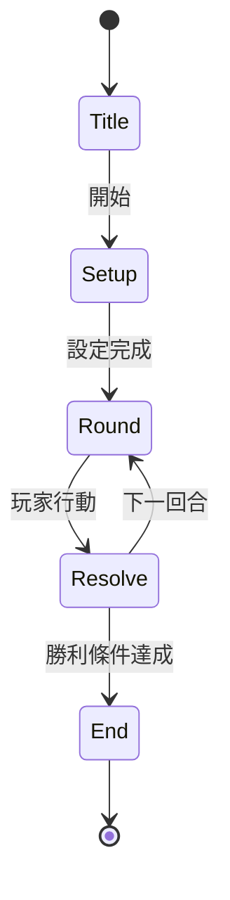

# {遊戲名} 設計規格

> **設計真理檔**。`game-prototype` / `game-develop` 兩支 skill 共用。實作（HTML）有衝突時以本檔為準；本檔有未明處以實作為準後回填這裡。

---

## 核心玩法

- **類型**：{回合制 PvP / 即時動作 / 解謎 / 抽卡 / etc}
- **玩家數**：{1 / 2 / 4 / 多人 PvP / 多人協作}
- **勝利條件**：{HP 歸零 / 籌碼最多 / 時間結束 / etc}
- **一輪預估時間**：{N 分鐘}
- **平台輸入**：{滑鼠 / 鍵盤 / 觸控}

---

## State Machine

---

## Emoji ↔ 概念對照

prototype 階段建立、develop 階段補實際路徑。

| Emoji | 概念 | 替換素材路徑（develop 填） | 對應 sub-skill |
|-------|------|---------------------------|---------------|
| 🐉    | （範例）火龍怪物 | （待填）assets/portrait/dragon_fire.png | imagen-portrait |
| ❤️    | （範例）HP | （待填）assets/ui/heart_icon.png | imagen-ui |

---

## UI 結構

各畫面 + 元件清單：

### 進入畫面
- {元件 1}
- {元件 2}

### 主遊戲畫面
- {元件 1}
- {元件 2}

### 結算畫面
- {元件 1}

---

## 平衡假設

- {出招機率分布 / 數值範圍 / 公式}
- {期望值 / 變異數 假設}

---

## 角色 / 職業 persona

（develop 階段 dialogue-writer 會用到）

| 角色 | 性格摘要 | 對白語氣 |
|------|---------|---------|
| {角色 A} | {內向、謹慎} | {簡短、含蓄} |

---

## 已知未解問題

- {playtest 回饋待處理項}
- {平衡未驗證項}
